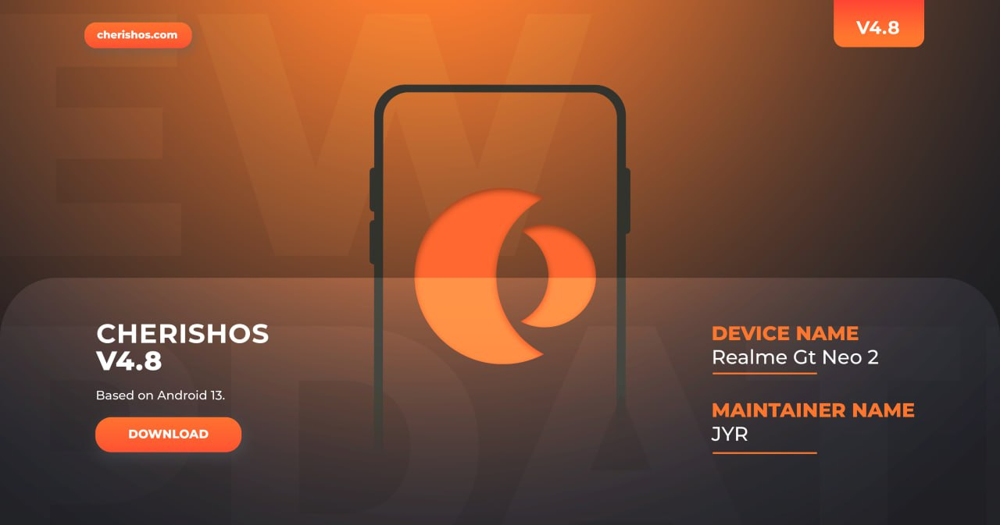

# CherishOS v4.8

**Android:** 13

**Статус:** Official

**Дата билда:** 18.06.2023

**Автор/разработчик:** JYR_RC

---

<b> Список изменений</b>

* Интегрировано обновление безопасности за май в исходный код прошивки.
* Улучшены стили Quick Settings (QS).
* Заменены иконки блокировки экрана на двухцветные иконки.
* Добавлены стили фона часов в строке состояния.
* Режим "карман": Обновлен стиль в соответствии с последними спецификациями OxygenOS.
* Исправлена интенсивность размытия на экране блокировки.
* PixelPropsUtils: Эмулируется ROG Phone для игры FIFA Mobile.
* Исправлена проблема с восстановлением данных Google, спасибо @EvolutionX.
* Улучшена анимация расширения уведомлений в Quick Settings.
* Улучшена работа системы.

<b> Инструкция по установке</b>

* Загрузитесь в рекавери (Recovery).
* Выполните форматирование данных (Format Data), набрав yes.
* Прошиваем ROM.
* Делаем Wipe (Dalvik/Cache).
* Перезагрузка в систему.

<b> Скриншоты</b>

<b> Скачать</b>

**Gapps:**
* [SourceForge](https://sourceforge.net/projects/cherish-os/files/device/bitra/Cherish-OS-v4.8-20230617-1415-bitra-OFFICIAL-GApps.zip/download)

**Vanilla**
* [SourceForge](https://sourceforge.net/projects/cherish-os/files/device/bitra/Cherish-OS-v4.8-20230617-2016-bitra-OFFICIAL-Vanilla.zip/download)

