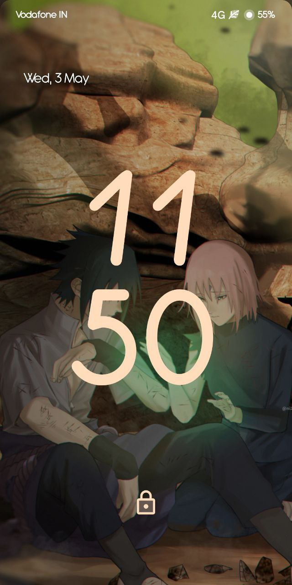
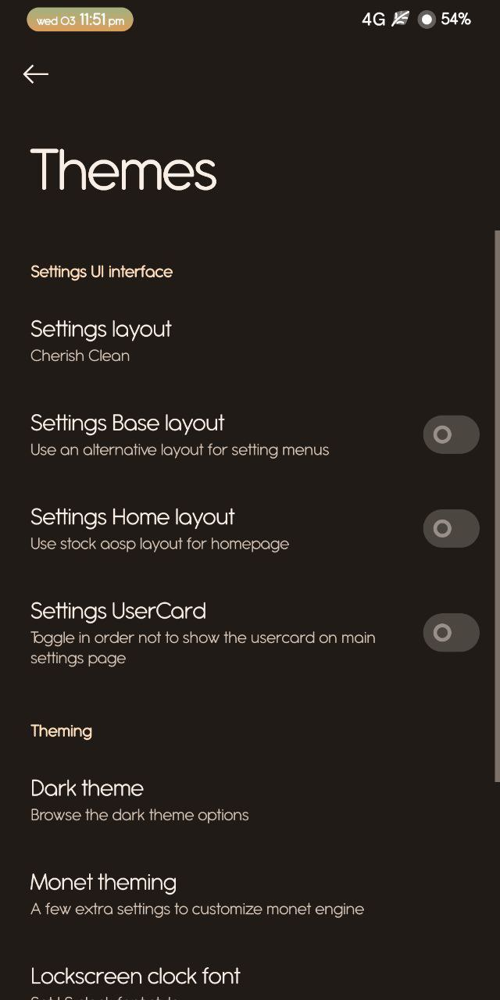
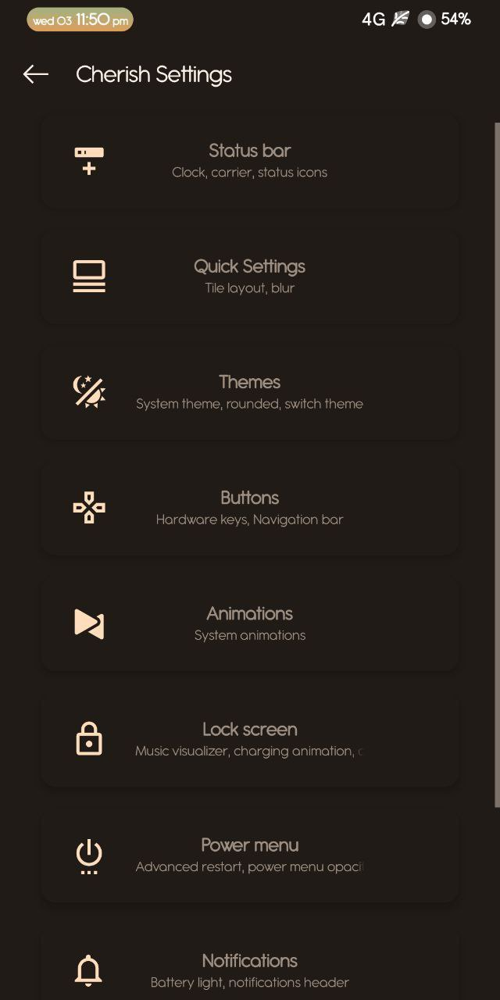
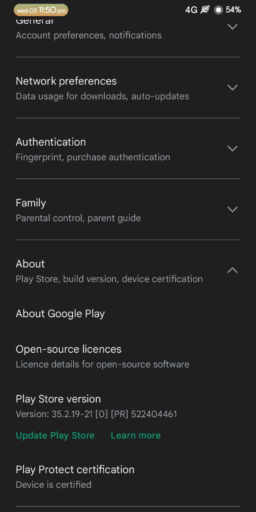
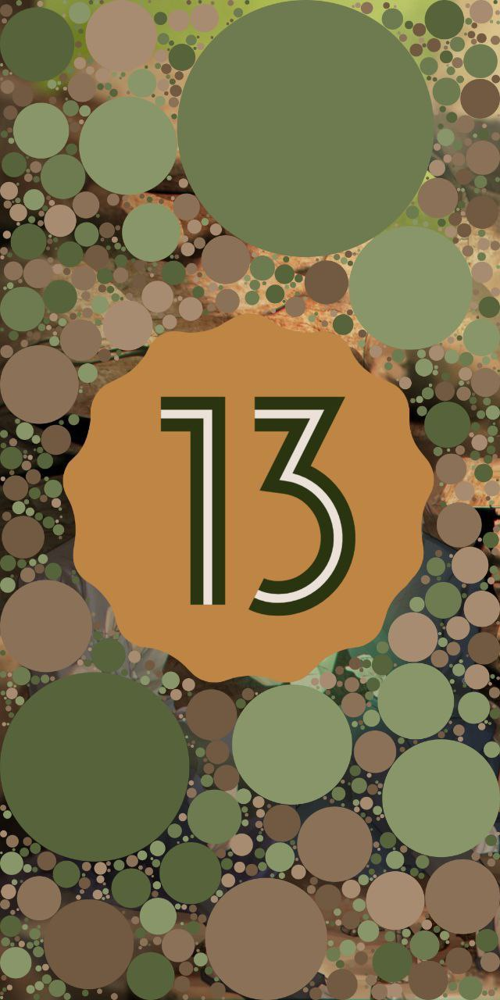
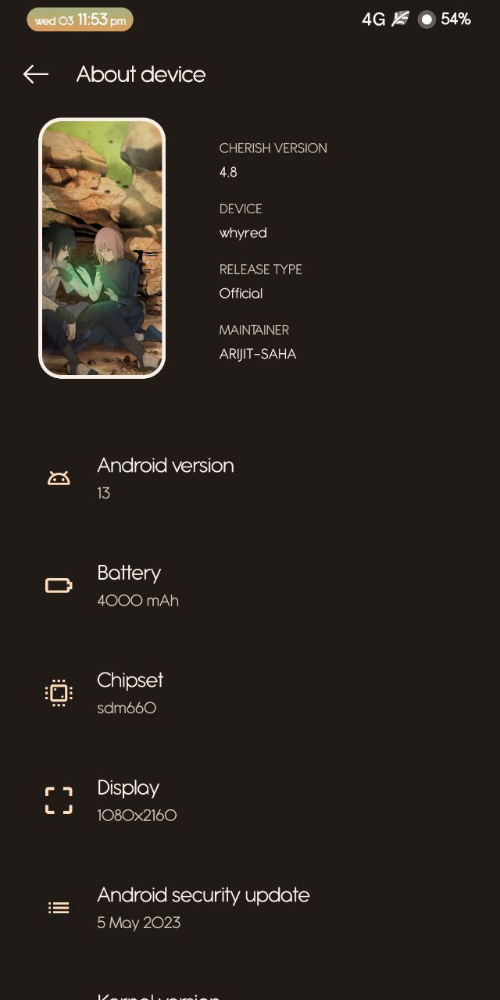
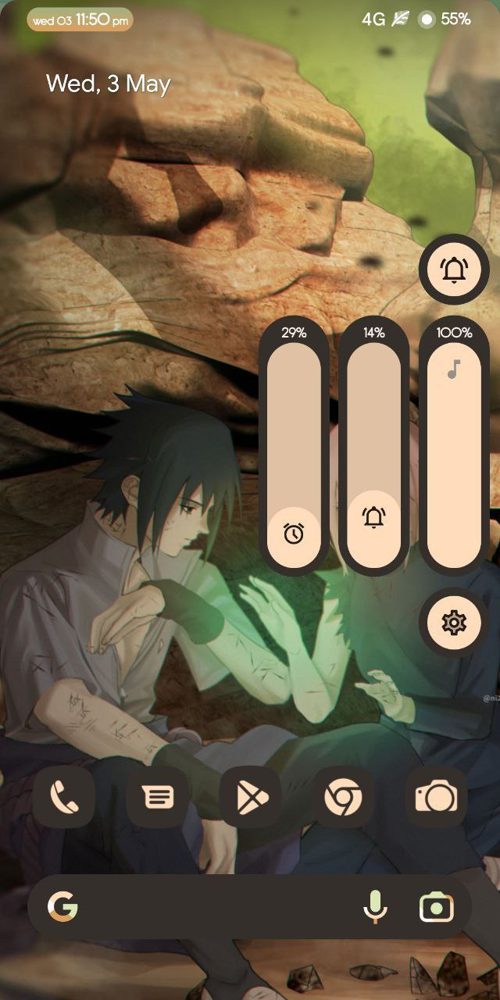
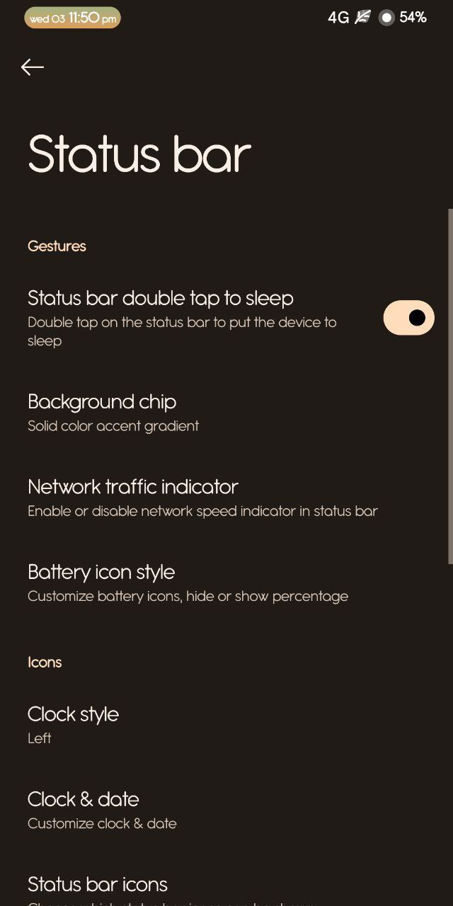
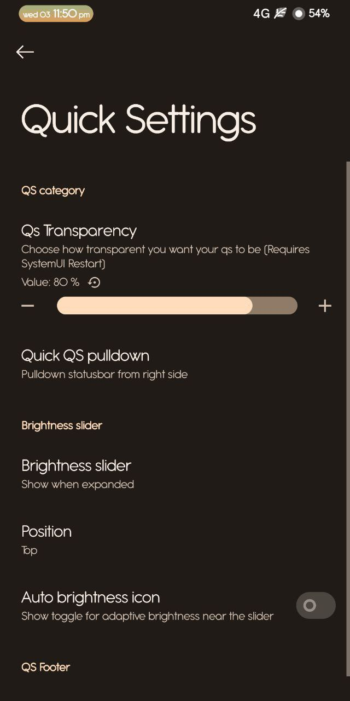
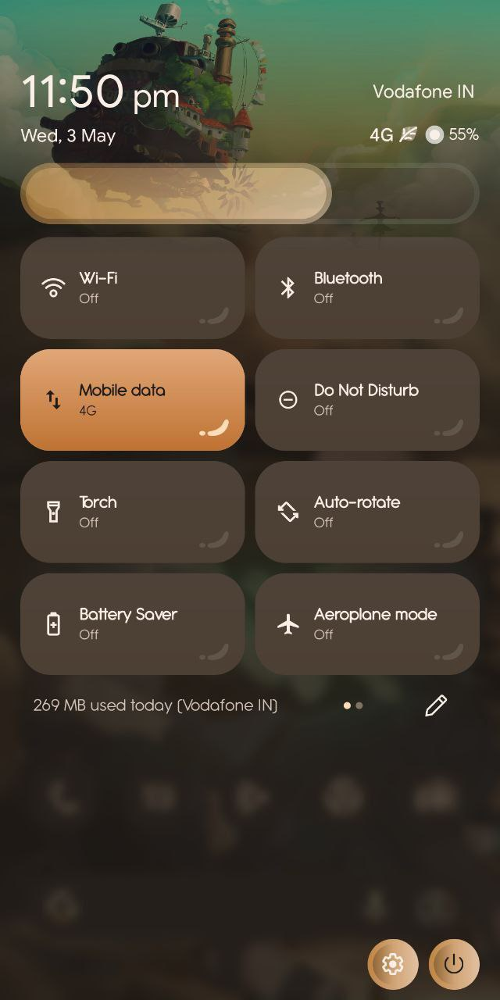

  

# CherishOS v4.8

* **Android:** 13
* **Статус:** Official
* **Дата билда:** 18.06.2023
* **Мейнтейнер:** JYR_RC

---

<b>  Список изменений </b>

 

* Интегрировано обновление безопасности за май в исходный код прошивки.
* Улучшены стили Quick Settings (QS).
* Заменены иконки блокировки экрана на двухцветные иконки.
* Добавлены стили фона часов в строке состояния.
* Режим "карман": обновлен стиль в соответствии с последними спецификациями OxygenOS.
* Исправлена интенсивность размытия на экране блокировки.
* PixelPropsUtils: эмулируется ROG Phone для игры FIFA Mobile.
* Исправлена проблема с восстановлением данных Google (спасибо @EvolutionX).
* Улучшена анимация расширения уведомлений в Quick Settings.
* Улучшена общая производительность и стабильность системы.

 Инструкция по установке 

1. Загрузитесь в кастомное рекавери (Recovery).
2. Выполните форматирование данных (`Format Data` через ввод `yes`).
3. Прошейте zip-архив с ROM.
4. Выполните `Wipe Dalvik / ART Cache`.
5. Перезагрузитесь в систему (`Reboot to System`).

 Скриншоты

 

  
  
  

  
  
  

  
  
  

  

 Скачать 

 

**GApps сборка:**
* [SourceForge](https://sourceforge.net/projects/cherish-os/files/device/bitra/Cherish-OS-v4.8-20230617-1415-bitra-OFFICIAL-GApps.zip/download)

**Vanilla сборка:**
* [SourceForge](https://sourceforge.net/projects/cherish-os/files/device/bitra/Cherish-OS-v4.8-20230617-2016-bitra-OFFICIAL-Vanilla.zip/download)

