

  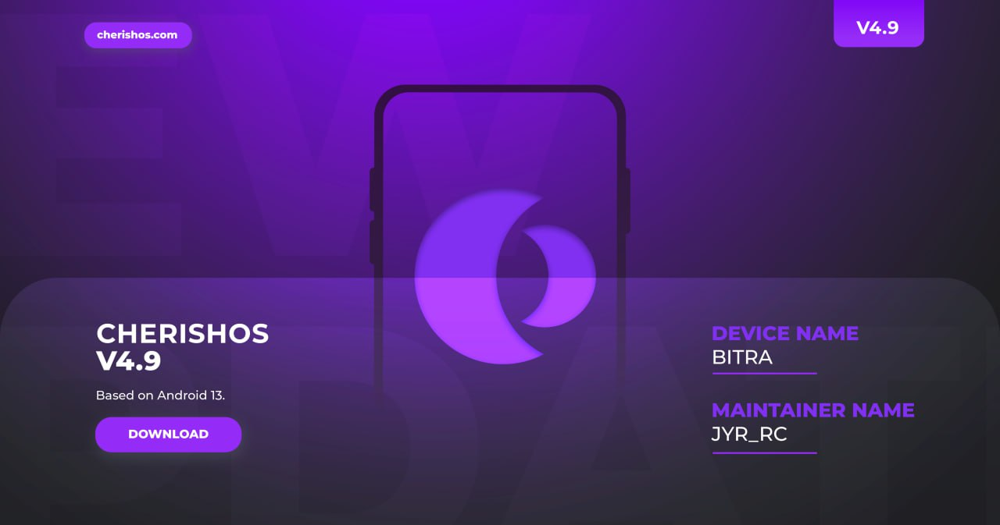

# CherishOS v4.9

* **Android:** 13
* **Статус:** Official
* **Дата билда:** 02.07.2023
* **Мейнтейнер:** JYR_RC

---

<b>  Список изменений </b>

 

* Завершена перебазировка исходного кода.
* Интегрирован июньский патч безопасности.
* Устранены некоторые проблемы.
* Временно удалены некоторые функции.
* Улучшена система.
* Добавлены некоторые новые возможности настройки.

<b> Инструкция по установке</b>

1. Загрузитесь в кастомное рекавери (Recovery).
2. Выполните форматирование данных (`Format Data` через ввод `yes`).
3. Прошейте zip-архив с ROM.
4. Выполните `Wipe Dalvik / ART Cache`.
5. Перезагрузитесь в систему (`Reboot to System`).

<b> Скриншоты</b>

 

  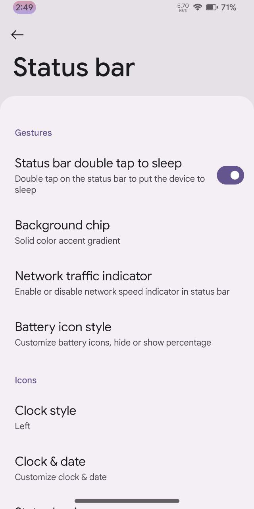
  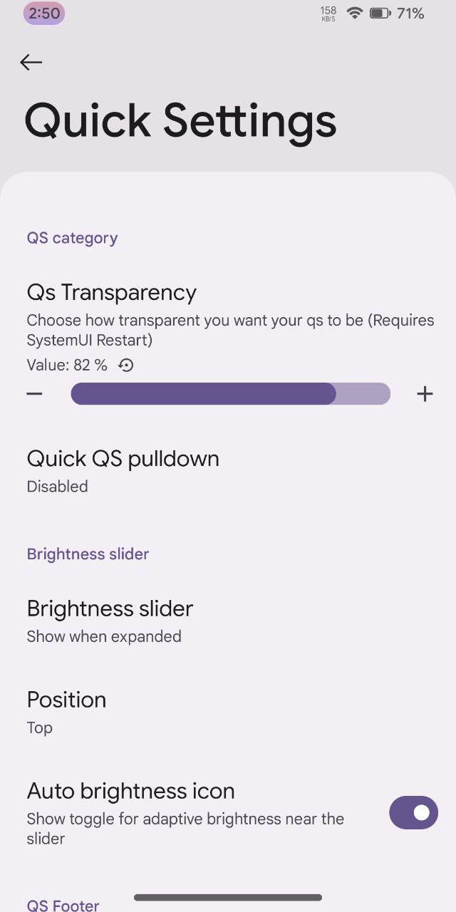
  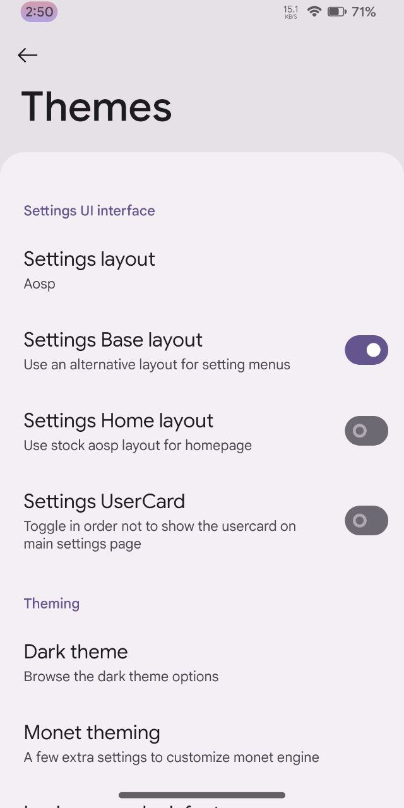

  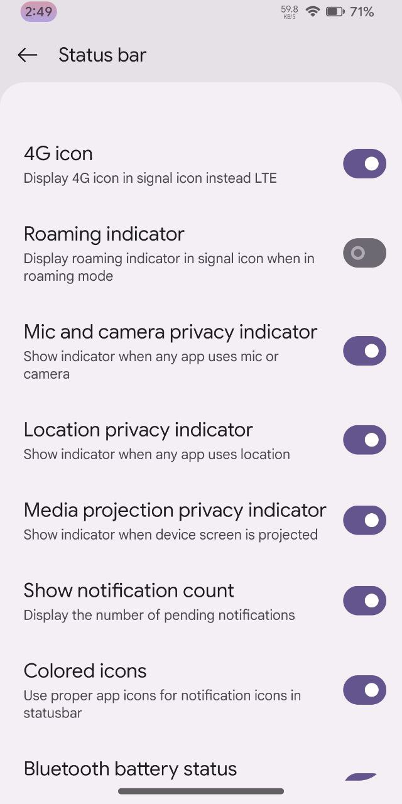
  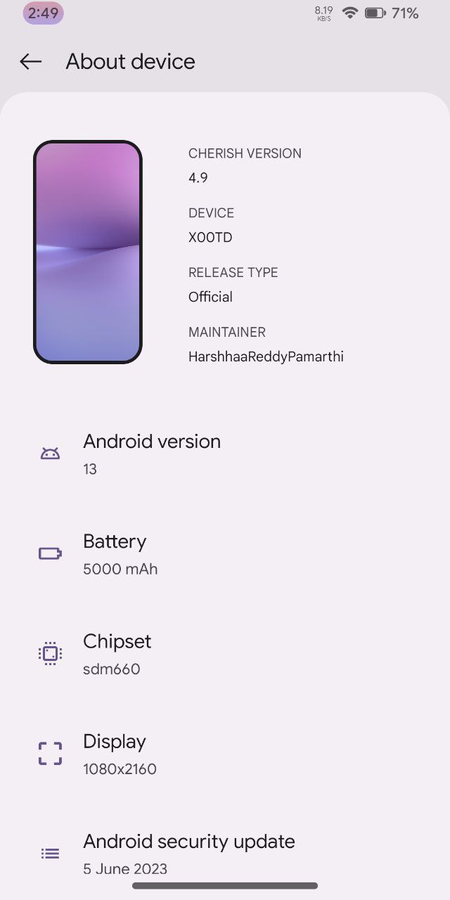
  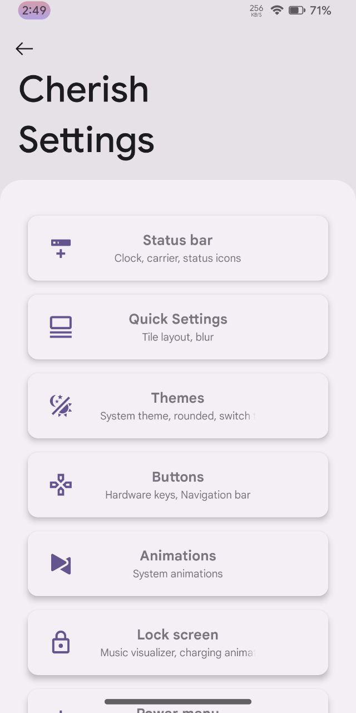

  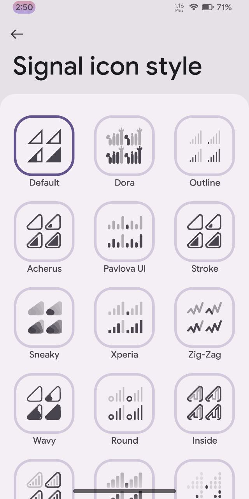
  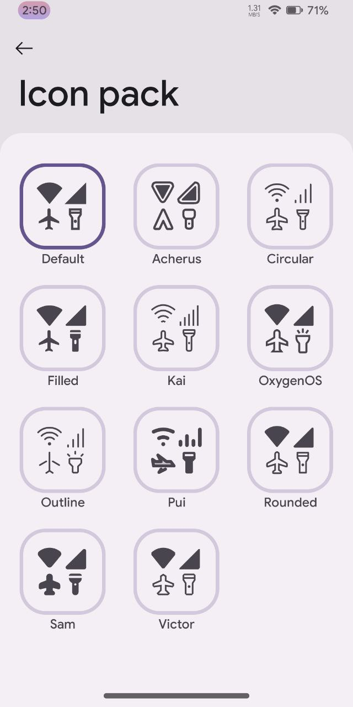
  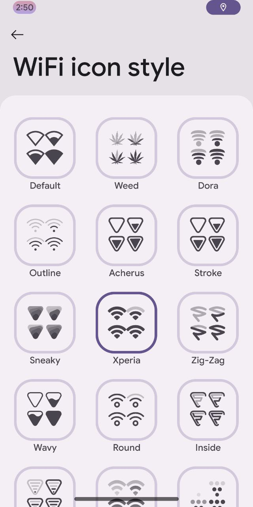

  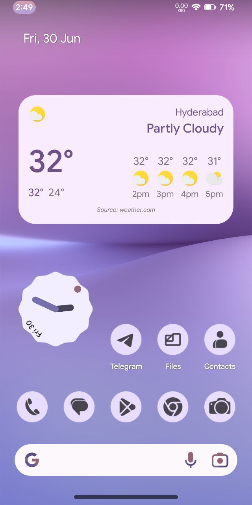

<b> Скачать</b>

 

**GApps сборка:**
* [SourceForge](https://sourceforge.net/projects/cherish-os/files/device/bitra/Cherish-OS-v4.9-20230701-1341-bitra-OFFICIAL-GApps.zip/download)

